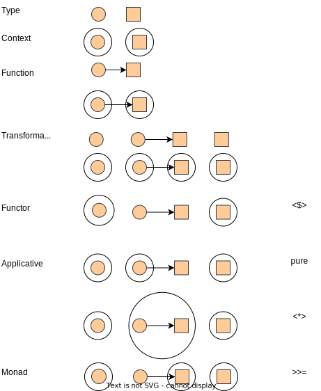

# Haskell
* https://www.haskell.org/

> Haskell is a purely functional programming language that features referential transparency, immutability and lazy evaluation.

Features:
- **Statically typed**: Every expression in Haskell has a type which is determined at compile time. All the types composed together by function application have to match up. If they don't, the program will be rejected by the compiler. Types become not only a form of guarantee, but a language for expressing the construction of programs.
- **Purely functional**: Every function in Haskell is a function in the mathematical sense (i.e., "pure"). Even side-effecting IO operations are but a description of what to do, produced by pure code. There are no statements or instructions, only expressions which cannot mutate variables (local or global) nor access state like time or random numbers.
- **Type inference**: You don't have to explicitly write out every type in a Haskell program. Types will be inferred by unifying every type bidirectionally. However, you can write out types if you choose, or ask the compiler to write them for you for handy documentation.
- **Concurrent**: Haskell lends itself well to concurrent programming due to its explicit handling of effects. Its flagship compiler, GHC, comes with a high-performance parallel garbage collector and light-weight concurrency library containing a number of useful concurrency primitives and abstractions.
- **Lazy**: Functions don't evaluate their arguments. This means that programs can compose together very well, with the ability to write control constructs (such as if/else) just by writing normal functions. The purity of Haskell code makes it easy to fuse chains of functions together, allowing for performance benefits.
- **Packages**: Open source contribution to Haskell is very active with a wide range of packages available on the public package servers.

## Actions
* [Examples in 'Get Programming with Haskell'](./get-programming-with-haskell/README.md)
* [Examples in 'Effective Haskell'](./effective-haskell/README.md)
* [Examples in 'Developing Web Apps with Haskell and Yesod'](./learn-yesod/README.md)

## Graphs

- Context in Types

## TODOs

- Library document: `Prelude` in GHC-9.4.8, GHC langauge extensions, etc.
- [x] Testing framework: QuickCheck.
- Application configuration: YAML, JSON, etc.
- Database libraries: MySQL, PostgreSQL, etc.
- Message Broker libraries: Kafka etc.
- Web framework: Yesod.
- Build tools configuration: cabal, stack.
